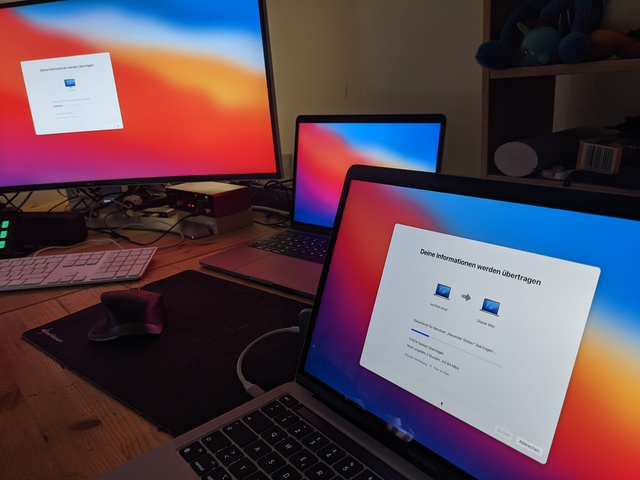
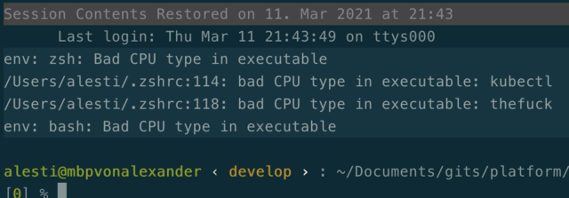
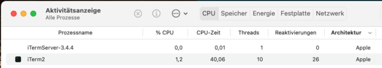
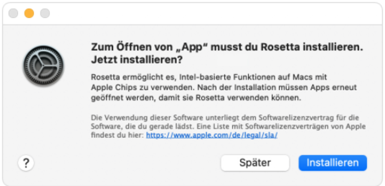
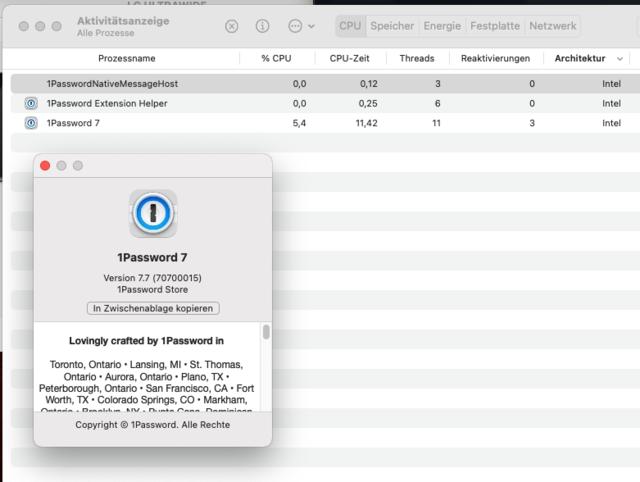
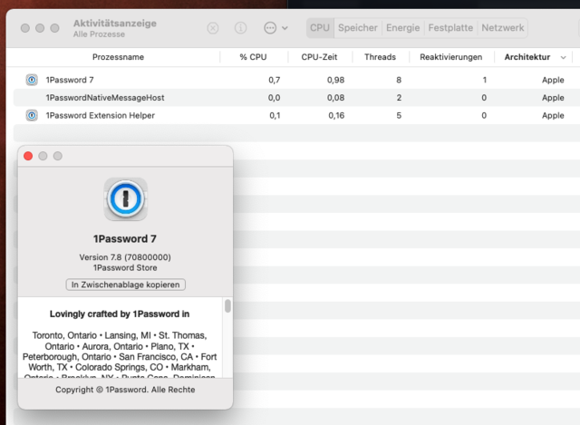

# [M1 - mainz](https://twitter.com/astielau/status/1370303446990127106)
## I will update this guide if interesting things happen.

After a some drawbacks with the delivery (UPS oopsied for the first time in
known history) i finally got my companys new arm powered macbook pro. 

I slurped my intel mac directly into the m1 (i started to call it mainz) with
the migration assistant (https://support.apple.com/en-us/HT204350).




## WTF Rosetta2? 

After the first boot into the intel mac image i supposed to
run into a lot of errors, but it looked like my typical desktop, my running
software - what?

My [zsh, running in iterm2 yelled at
me](https://twitter.com/astielau/status/1370120472445259779), but thats all in
the first round.  



Ok, sure, these binaries are x86, but are iterm and zsh already an universal2 binary? And a lot of stuff in the background also?
Iterm (and zsh) are:

 

I was not sure, if Rosetta2 (the intel virtualisation) is running by default .. starting chrome …
Ok, a windows pops up and ask me to enable rosetta:



I denied it for the moment, but installed a universal2 binary version of chrome instead. 
=> Rosetta is not enabled by default.

We use 1password, and today they released a new version which is the first which will run native on M1. I made two screenshots of the process table before and after the update.



 

Same with slack and other.

That simply works - this part of the m1 migration stuff is really boooring - so far.

## Docker

**Update 2021-04-16** 

[M1 Docker is stable now](https://hub.docker.com/editions/community/docker-ce-desktop-mac)

### Ok, whats up with docker? 

https://docs.docker.com/docker-for-mac/apple-m1/

Tried with an image which uses a lot of network stuff (openvpn and wireguard,
needs NET_ADMIN capabilities...) and was build for x86 - works fine, if it is
run with `docker run --platform linux/amd64  -e "LALALA_DNS...` 

Without that flag it issues `WARNING: The requested image's platform
(linux/amd64) does not match the detected host platform (linux/arm64/v8) and no
specific platform was requested but starts anyway`.

Looks good so far, need to test things like dind, but later...

## Homebrew

Brew is able to run on M1 since v3.0: https://brew.sh/2021/02/05/homebrew-3.0.0/
I running v3.0.5 and have currently 103 outdated formulae.

It is not possible to simple reinstall or upgrade a formula, it will be
reinstalled in `/usr/local/` (which is for x86 binaries only). I found that
deleting all cached stuff helps to find the right way:

`brew cleanup --prune=all`

Than i got:

```
brew install bash
Error: Cannot install in Homebrew on ARM processor in Intel default prefix (/usr/local)!
Please create a new installation in /opt/homebrew using one of the
"Alternative Installs" from:
  https://docs.brew.sh/Installation
You can migrate your previously installed formula list with:
  brew bundle dump
```

So i read it:

```
mkdir -p ~/tmp/x86-brew/ ; cd ~/tmp/x86-brew/ 
brew bundle dump                              # create a list of the old stuff
xcode-select --install                        # not sure if neccessary, but i want the cli tools native
/bin/bash -c "$(curl -fsSL https://raw.githubusercontent.com/Homebrew/install/HEAD/install.sh)"
                                              # install brew
echo 'eval "$(/opt/homebrew/bin/brew shellenv)"' >> /Users/alesti/.zprofile
eval "$(/opt/homebrew/bin/brew shellenv)"     # use the new brew binary
which brew                                    # should sit in /opt/homebrew/bin/ now
brew bundle install ~/tmp/x86-brew/Brewfile   # This is a good moment to stare at the cpu utilization :-)
```

No touch-and-go sounds on this mission - there are no fans in it. I like.

This succeeded with some errors:

```
grep Error brew-install.log
Error: kubernetes-cli: no bottle available!
Error: minikube: no bottle available!
Error: pandoc: no bottle available!
Error: pandoc-citeproc: no bottle available!
Error: vault: no bottle available!
Error: wireshark: no bottle available!
```

It is possible to search which formulae are available for which arch with
https://formulae.brew.sh/formula/ 

I can decide to use the x86 builds instead, or try to build from source with
`brew install --build-from-source`, but this is not supported.

I need now to clear up my PATH, while i am used to preload a lot stuff to be
sure not to use the mac shipped bsd tools (instead of the gnu flavored tools my
collegues with linux use in scripts).

My old PATH looks messy, it is some boring work to change it:

```
PATH=~/fcloud-tools:~/bin:/usr/local/opt/terraform@0.11/bin:/usr/local/opt/qt/bin:/usr/local/Cellar/grep/3.4/libexec/gnubin/:/usr/local/Cellar/gnu-sed/4.8/libexe    c/gnubin:/usr/local/Cellar/findutils/4.7.0/libexec/gnubin:/usr/local/opt/helm@2/bin:/usr/local/opt/gettext/bin:/usr/local/opt/coreutils/libexec/gnubin:/usr/local/opt/openssl/bin:/usr/local/opt/gnu-getopt/bin:/usr/local/opt/curl/bin:/usr/local/bin:/usr/bin:/bin:/usr/local/sbin:/usr/sbin:/sbin:/usr/local/MacGPG2/bin:$HOME/.linkerd2/bin:/usr/local/texlive/2020/bin/x86_64-darwin:$HOME/go/bin
```

Brew works, i need to remove the most stuff from the x86 directories later.
Afterwards (in march 2022) it is possible to remove the amd64 brew stuff completly with:

`for i in $(/usr/local/Homebrew/bin/brew list) ; do /usr/local/Homebrew/bin/brew uninstall $i  --ignore-dependencies ; done`


## Oh, noes!
### VirtualBox 

will not and cannot be ported - it is simply not possible while virtualbox is
not an CPU emulator but an x86 hypervisor - it seems to need a real x86 cpu
underneath. 

I do not use virtualbox, but sometimes vagrant, and vagrant uses it as default
provider, so this might be relevant for others. 

### backup&sync

The migration assistant will bother googles backup&sync, it will not get that
this is a new computer and try to sync with the data of the old one - not a cpu arch thingie. 


## sidenotes / resources

- List of arm ready software https://isapplesiliconready.com/ - I think the best time for this side is already over
- a little bit Rosetta https://developer.apple.com/documentation/apple-silicon/about-the-rosetta-translation-environment
- No firmware password anymore, boot modes: https://www.macworld.co.uk/how-to/how-to-m1-macs-3801104/

## tbc

I will continue to add things
